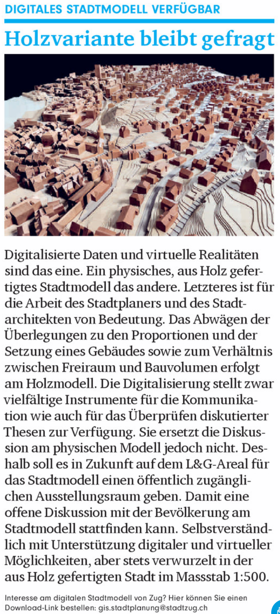

town-zug-3d-data

In an article in the ["Stadtmagazin Nr. 19" from January 2018](https://bc-v2.pressmatrix.com/de/profiles/0fcda383a928/editions/6a240f4b37f76b95812e/pages/page/6]) they mentioned a digital model of the town Zug.

You can send an email to <a href="mailto:gis.stadtplanung@stadtzug.ch">gis.stadtplanung@stadtzug.ch</a> to get the data.
Normally after a short period you get a download link with the data. You get the data as different blender-files. Additional you get exported data in .dwg/.dxf and .fbx.

